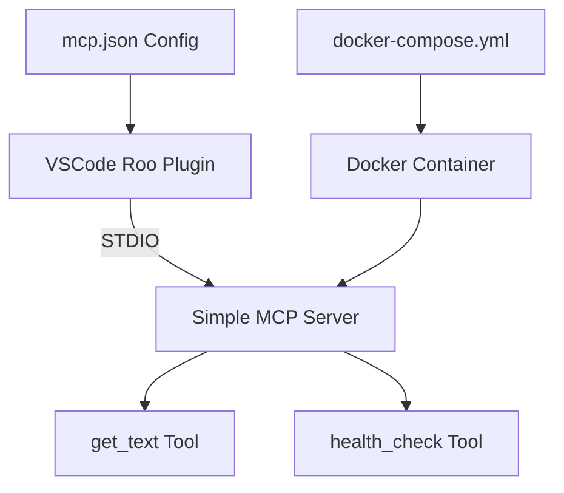

# Simple MCP Server - VSCode Roo Integration

## Overview

This is a minimal Model Context Protocol (MCP) server built with FastMCP 2.0+ designed specifically for VSCode Roo plugin integration. The server provides basic tools for testing MCP integration and demonstrates how to create a focused, STDIO-only MCP server without the complexity of dual transport modes.

### What's Included

- **Simple MCP Server**: A FastMCP-based server with two basic tools
- **STDIO-Only Design**: Streamlined for VSCode Roo plugin integration
- **Docker Support**: Complete containerization for easy deployment
- **Minimal Configuration**: Ready-to-use setup with minimal complexity

### Available Tools

1. **`get_text`**: Returns a simple "hello world" message with timestamp
2. **`health_check`**: Performs a basic health check of the MCP server

## Quick Start

### Prerequisites

- Docker and Docker Compose installed
- VSCode with the Roo plugin installed
- Python 3.11+ (if running locally without Docker)

## Docker Usage Instructions

### 1. Running the Server with Docker Compose

Navigate to the `simple-mcp-server` directory and start the server:

```bash
cd simple-mcp-server
docker-compose up -d
```

This will:
- Build the Docker image if it doesn't exist
- Start the server in STDIO mode
- Create a `mcp-network` for container communication

### 2. Verifying the Server is Running

Check if the container is running:

```bash
docker-compose ps
```

You should see the `simple-mcp-server` container with status "Up".

Check the server logs:

```bash
docker-compose logs -f simple-mcp-server
```

You should see output like:
```
simple-mcp-server | INFO:__main__:Starting Simple MCP Server in STDIO mode...
simple-mcp-server | INFO:__main__:Starting MCP server with STDIO transport for VSCode Roo...
```

### 3. Stopping the Server

To stop the server:

```bash
docker-compose down
```

To stop and remove volumes:

```bash
docker-compose down -v
```

## VSCode Roo Integration Steps

### 1. Understanding the MCP Configuration

The server includes a pre-configured [`mcp.json`](mcp.json) file:

```json
{
  "mcpServers": {
    "simple-hello-world": {
      "command": "python",
      "args": [
        "main.py",
        "--stdio"
      ],
      "cwd": "./simple-mcp-server",
      "disabled": false,
      "alwaysAllow": []
    }
  }
}
```

### 2. Configuring VSCode Roo Plugin

#### Option A: Copy the Entire Configuration

1. Copy the contents of [`mcp.json`](mcp.json) from this directory
2. Open VSCode Settings (Cmd/Ctrl + ,)
3. Search for "roo" or "mcp"
4. Find the "Roo: MCP Servers" setting
5. Click "Edit in settings.json"
6. Replace or merge the `mcpServers` section with the copied configuration

#### Option B: Add to Existing Configuration

If you already have MCP servers configured, add just the new server entry:

```json
{
  "roo.mcpServers": {
    "your-existing-server": {
      // ... your existing configuration
    },
    "simple-hello-world": {
      "command": "python",
      "args": [
        "main.py",
        "--stdio"
      ],
      "cwd": "./simple-mcp-server",
      "disabled": false,
      "alwaysAllow": []
    }
  }
}
```

### 3. Important Configuration Notes

- **`cwd` Path**: Make sure the `cwd` path points to the correct location of your `simple-mcp-server` directory relative to your VSCode workspace
- **Python Path**: Ensure `python` in the `command` field points to a Python installation that has the required dependencies installed
- **Dependencies**: The Python environment must have `fastmcp>=2.0.0` installed

### 4. Installing Python Dependencies (Local Mode)

If running in local mode (not Docker), install the required dependencies:

```bash
cd simple-mcp-server
pip install -r requirements.txt
```

### 5. Restarting/Reloading the Roo Plugin

After updating the configuration:

1. **Reload VSCode Window**: 
   - Press `Cmd/Ctrl + Shift + P`
   - Type "Developer: Reload Window"
   - Press Enter

2. **Or Restart VSCode**: Close and reopen VSCode completely

### 6. Verifying the Server Connection

1. Open the VSCode Command Palette (`Cmd/Ctrl + Shift + P`)
2. Look for Roo-related commands
3. Check the VSCode Output panel:
   - Go to View → Output
   - Select "Roo" from the dropdown
   - Look for connection messages about the `simple-hello-world` server

You should see messages indicating the MCP server has connected successfully.

## Testing Instructions

### 1. Testing with VSCode Roo Integration

Once configured in VSCode Roo:

1. **Open a Roo Chat**: Start a new conversation with Roo
2. **Use the get_text tool**: In your prompt, mention using the get_text tool:
   ```
   Please use the get_text tool to get some text
   ```
3. **Verify the Response**: Roo should be able to call the tool and return "hello world"

### 2. Testing the Server Manually

You can also test the server manually in STDIO mode:

```bash
cd simple-mcp-server
python main.py --stdio
```

Then send MCP protocol messages (this is advanced testing).

### 3. Confirming VSCode Roo Plugin Communication

**Successful Integration Indicators:**

1. **No Error Messages**: Check VSCode Output panel (Roo channel) for connection errors
2. **Tool Availability**: Roo should be able to discover and use the `get_text` and `health_check` tools
3. **Successful Tool Calls**: When you ask Roo to use the tools, it should return proper responses

**Example Roo Prompts to Test:**

```
Can you use the get_text tool to retrieve some text?
```

```
Please run a health check using the health_check tool
```

## Troubleshooting

### Common Issues and Solutions

#### 1. "Command not found: python"

**Problem**: The `python` command is not available or points to the wrong version.

**Solutions**:
- Update the `mcp.json` configuration to use `python3` instead of `python`
- Or use the full path to Python: `/usr/bin/python3` or `/usr/local/bin/python3`
- On Windows, try `py` instead of `python`

#### 2. "Module 'fastmcp' not found"

**Problem**: FastMCP is not installed in the Python environment.

**Solutions**:
- Install dependencies: `pip install -r requirements.txt`
- Make sure you're using the correct Python environment
- Consider using a virtual environment:
  ```bash
  python -m venv venv
  source venv/bin/activate  # On Windows: venv\Scripts\activate
  pip install -r requirements.txt
  ```

#### 3. "Working directory not found"

**Problem**: The `cwd` path in `mcp.json` is incorrect.

**Solutions**:
- Update the `cwd` path to match your actual directory structure
- Use absolute paths if relative paths don't work
- Ensure the path is relative to your VSCode workspace root

#### 4. Server Not Connecting to Roo

**Problem**: VSCode Roo can't connect to the MCP server.

**Solutions**:
- Check VSCode Output panel (Roo channel) for error messages
- Verify the `mcp.json` configuration syntax
- Restart VSCode completely
- Test the server manually: `python main.py --stdio`
- Check file permissions on the `simple-mcp-server` directory

#### 5. Docker Container Won't Start

**Problem**: Docker container fails to start or exits immediately.

**Solutions**:
- Check Docker logs: `docker-compose logs simple-mcp-server`
- Rebuild the container: `docker-compose build --no-cache`
- Check Docker daemon is running

#### 6. Tools Not Available in Roo

**Problem**: Roo doesn't recognize the `get_text` or `health_check` tools.

**Solutions**:
- Verify the server is running and connected
- Check that the server is running in STDIO mode (with `--stdio` flag)
- Restart the Roo plugin/VSCode
- Check for any error messages in the server logs

### Debug Mode

To run the server with more verbose logging:

```bash
# Local STDIO mode with debug
PYTHONPATH=. python -u main.py --stdio

# Docker with debug logs
docker-compose logs -f simple-mcp-server
```

### Getting Help

If you continue to experience issues:

1. Check the VSCode Output panel (Roo channel) for detailed error messages
2. Verify all file paths and permissions
3. Test the server independently before integrating with Roo
4. Ensure all dependencies are properly installed

## Architecture Overview



## File Structure

```
simple-mcp-server/
├── README.md              # This file
├── main.py               # MCP server implementation
├── requirements.txt      # Python dependencies
├── mcp.json             # VSCode Roo configuration
├── Dockerfile           # Docker container definition
├── docker-compose.yml   # Docker Compose configuration
└── test files...        # Various test scripts
```

## Next Steps

Once you have the simple MCP server working with VSCode Roo:

1. **Explore the Code**: Review [`main.py`](main.py) to understand how MCP tools are implemented
2. **Create Custom Tools**: Add your own tools using the `@mcp.tool()` decorator
3. **Add Resources**: Implement MCP resources using `@mcp.resource()`
4. **Scale Up**: Use this as a template for more complex MCP servers

## License

This is a demonstration/example project. Use and modify as needed for your own MCP server implementations.
